# Impacto de las Redes Sociales en la Salud Mental de los Adolescentes

Repositorio para la entrega individual del Módulo 2 de Inteligencia Artificial.

---

# Información del Alumno

| Dato | Información |
|---|---|
| Nombre | Yael Cortés Rubio |
| Matrícula | A01275893 |
| Materia | Desarrollo de aplicaciones avanzadas de ciencias computacionales |
| Profesor | Dr. Benjamín Valdés Aguirre |

---

# Introducción

El uso de las redes sociales en adolescentes ha incrementado significativamente durante los ultimos años. Plataforma digitales como Instagram, TikTok y X forman parte de la vida cotidiana de millones de jovenes y han cambiado la manera en la que interactúan socialmente.

Sin embargo, diversos estudios han señalado que el uso excesivo de redes sociales puede relacionarse con problemas como:

- Ansiedad
- Estrés
- Baja calidad de sueño
- Aislamiento social
- Depresión  

Debido a esto, el presente proyecto busca analizar la relación entre hábitos digitales y salud mental adolescentes mediante técnicas de Machine Learning supervisado.

El objetivo principal es indentificar patrones dentro del dataset que permitan predecir indicadores de depresión utilizando variables relacionadas con comportamientos social, emocional y académico. 

---

---

# Objetivo del proyecto

El objetivo principal del proyecto es desarrollar un modelo de clasificación capaz de predecir la variable:

```python
depression_label
```
La cual representa si un adolescente presenta indicadores asociados a depresión.

Las variables utilizadas incluyen información relacionadas con:

- Uso de redes sociales
- Ansiedad 
- Estrés
- Calidad de sueño
- Interacción social
- Rendimiento académico

---


# Entregables del Módulo

|  Semana  |                Actividad                |   Porcentaje  |
|----------|-----------------------------------------|---------------|
| Semana 2 | Generación o selección del set de datos |      20%      |
| Semana 2 | Preprocesado de los datos               |      20%      |
| Semana 3 | Implementación del modelo               |      20%      |
| Semana 3 | Evaluación inicial del modelo           |      20%      |
| Semana 4 | Refinamiento del modelo                 |      20%      |
| Semana 5 | Entrega final y correcciones            | Entrega final |

---

# Criterios de Evaluación

## Semana 2 — Generación o selección del set de datos

- Obtener, generar o aumentar un set de datos
- Realizar la separación de datos de entrenamiento y prueba

## Semana 2 — Preprocesado de los datos

- Aplicar técnicas de escalamiento
- Realizar el preprocesamiento pertinente de los datos

## Semana 3 — Implementación del modelo

- Seleccionar un modelo respaldado por artículos científicos
- Implementar el modelo utilizando un framework adecuado

## Semana 3 — Evaluación inicial del modelo

- Seleccionar métricas adecuadas
- Reportar e interpretar resultados obtenidos

## Semana 4 — Refinamiento del modelo

- Medir el desempeño del modelo actual
- Ajustar hiperparámetros o arquitectura
- Comparar resultados y reportar mejoras

## Semana 5 — Entrega final

- Documentar correcciones realizadas
- Entregar versión final corregida

---

# Avance 1: Generación o selección del set de datos y preprocesado

Durante esta primera etapa se realizó la selección y preparación del dataset que será utilizado para entrenar futuros modelos de clasificación supervisada. El objetivo principal de esta fase fue garantizar que los datos tuvieran una estructura adecuada para el entrenamiento y evaluación de modelos de Machine Learning.

## Selección del set de datos

Se seleccionó un dataset relacionado con la salud mental adolescente y uso de redes sociales obtenido desde Kaggle.
El dataset contiene variables relacionadas con:

- Ansiedad
- Estrés
- Calidad de sueño
- Iteración social
- Rendimiento académico
- Tiempo de uso de redes sociales

La selección de este dataset se realizó debido a que representa un problema relevante actualmente dentro del área de salud mental adolescente.

## Análisis Inicial

Durante la exploración inicial se analizaron:

- Dimensiones del dataset
- Tipos de datos
- Valores nulos
- Registros duplicados
- Distribución de variables

Estas tareas permitieron comprender la estructura general de los datos.

## Limpieza y preprocesado de los datos

Posteriormente se realizaron tareas de preparación de datos para dejar el dataset listo.

Las técnicas aplicadas son:

- Eliminación de registros duplicados
- Transformación de variables categóricas mediante One Hot Encoding
- División de datos de entrenamiento y prueba
- Escalamiento de variables numéricas mediante StandarScaler

Estas transformaciones ayudan a mejorar la calidad de los datos y permiten que los algoritmos trabajen correctamente con variables numéricas normalizadas.

---

# Metodología de Trabajo

El proyecto sigue un flujo de trabajo típico utilizado en proyectos de Ciencia de Datos y Machine Learning supervisado. 

La estructura general del análisis fui inspirada en notebooks introductorios de Kaggle relacionados con clasificación supervisada, particularmente ejemplos basados en el dataset Titanic.

Referencia utilizada:

https://www.kaggle.com/datasets/algozee/teenager-menthal-healy 

Las etapas principales implementadas fueron:

1. Exploración inicial del dataset
2. Análisis Exploratorio de Datos (EDA)
3. Limpieza de datos
4. Transformación de variables
5. División de entrenamiento y prueba
6. Escalamiento de variables
7. Preparación para entrenamiento de modelos

Posteriormente, dichas técnicas fueron adaptadas al contexto específico del presente proyecto enfocado en salud mental adolescentes y uso de redes sociales.

---

# Dataset

El dataset contiene:

- 1200 registros
- 13 variables
- Información relacionada con:

|        Variable       |         Descripción         |
|-----------------------|-----------------------------|
|     Redes sociales    | Tiempo y frecuencia de uso  |
|        Ansiedad       |      Nivel de ansiedad      |
|         Estrés        |       Nivel de estrés       |
|         Sueño         |      Calidad del sueño      |
| Rendimiento académico |      Desempeño escolar      |
|   Interacción social  | Nivel de interacción social |

---

## EDA

Se realizó un análisis exploratorio de datos el objetivo de comprender mejor el comportamiento del dataset y detectar posibles patrones relevantes relacionadas con salud mental adolescente.

---

# Tecnologías y Librerías

## Lenguaje utilizado

- Python

## Librerías utilizadas

```python
pandas
numpy
matplotlib
seaborn
scikit-learn
```

## Herramientas utilizadas

- Jupyter Notebook
- Python
- GitHub

---

## Preprocesamiento de Datos

Antes de entrenar el modelo, se realizó una etapa de exploración y preparación de los datos, esto con el objetivo de comprender la estructura del dataset, identificar posibles problemas al transformar las variables a un formato adecuado.

Para ello primero cargamos el dataset

```python
df = pd.read_csv("../data/Teen_Mental_Health_Dataset.csv")
```
Esto con el fin de almacenar la información facilitando su manipulación, análisis y procesamiento.

## Exploración inicial del Dataset

A pesar de ya tener los datos almacenados, el objetivo no es únicamente mostrar datos, si no tambien entender, cuantas variables existen, que representan, los tipos de datos y si existen valores faltantes.

```python
df.head()
```
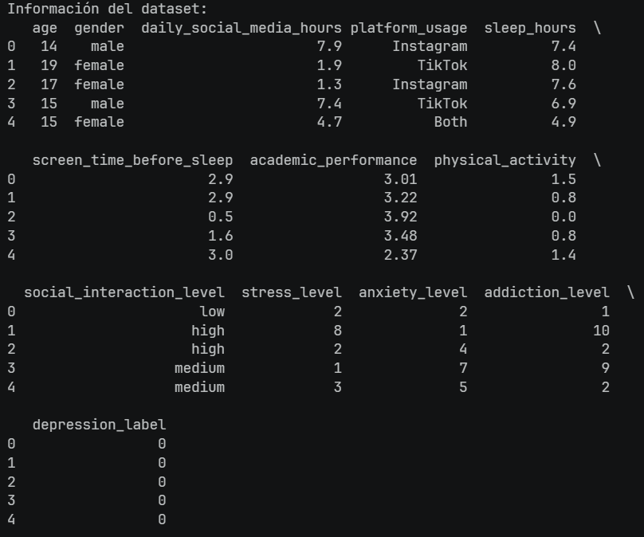

Esto es para revisar las primeras filas del dataset para verificar que la información se haya cargado correctamente.

```python
df.shape
```
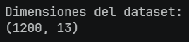

Esto nos ayuda a concer el número total de filas y columnas.

```python
df.info()
```
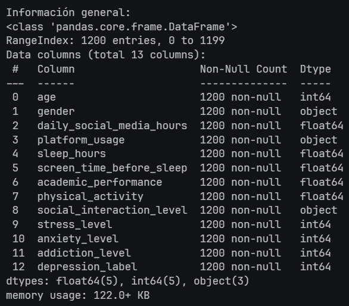

Esta función sirve para conocer el tipos de dato de cada variable, también verifica la presencia de valores faltantes.

```python
df.isnull().sum()
```
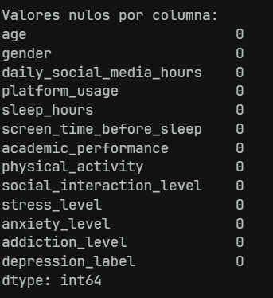

Esta función calcula la cantidad de valores faltantes en cada columna, lo cual en mi modelo señalo que no existe ningun valor faltante. Esto es importante porque los valores nulos pueden afectar el entrenamiento del modelo y generar resultados correctos.

```python
df.duplicated().sum()
```
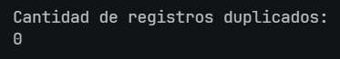

Tambien se verificó si exiten registros repetidos, esto porque en el entrenamiento puede generar sesgos, es decir, que algunas observaciones tendrían mas peso que otras. En este caso no se marco algun valor duplicado

```python
df = df.drop_duplicates()
```
Esta función elimina los datos duplicados, en este caso no es obligatorio implementarlo, ya que no existian valores duplicados, sin embargo, como parte del seguimiento de la estructura mostrada en la guía, lo implemente.

## Análisis Exploratorio de Datos (EDA)

El análisis exploratorio nos ayuda a comprender de una manera mas clara la distribución de las variables y detectar patrones que pudieran influir en la predicción de depresión.

### Distribución de la variable objetivo

Antes de entrenar un modelo de clasificación es importante verificar si las clases estan balanceadas, ya que un fuerte desbalance podría provocar que el modelo favorezca la clase mayoritaria.

```python
df["depression_label"].value_counts()
```
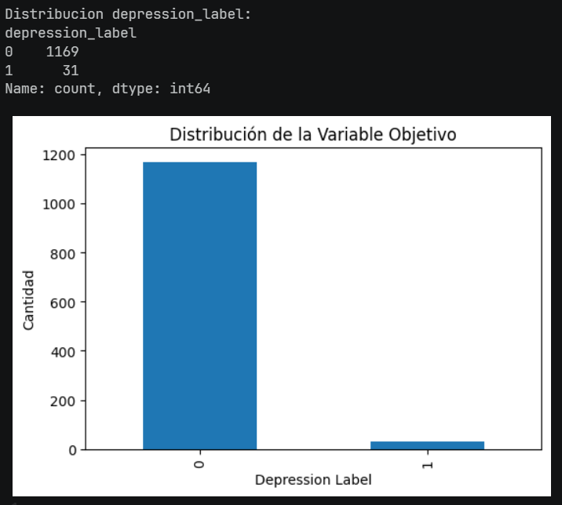

La distribución muestra un desbalance significativo entre las clases, lo que implica que el modelo podría tender a predecir con mayor frecuencia la clase mayoritaria. Debido a esta característica, métricas como el accuracy podrían resultar engañosas.

### Distribución de edades

La edad puede influir significativamente en la salud mental de los adolescentes. Analizar su distribución permite identificar grupos de edad predominantes y posibles sesgos de representación.

```python
df["age"].hist()
```
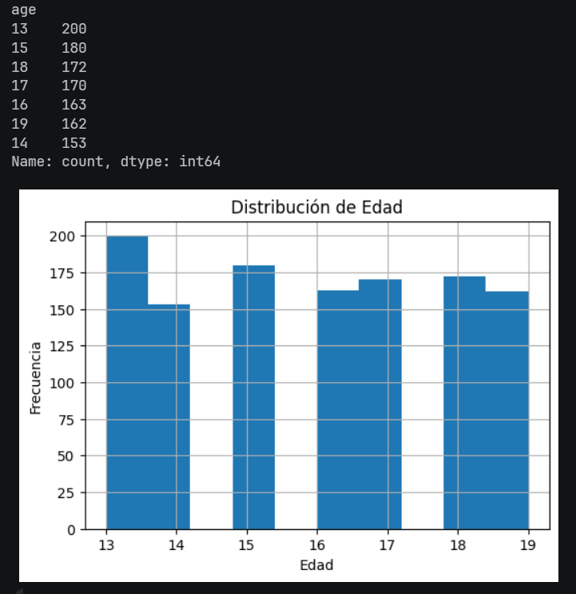

En esto caso, los registros se encuentran distribuidos entre los 13 y 19 años, con una representación relativamente equilibrada en todos los grupos de edad. 

### Distribución de género

El análisis de esta variable permite identificar posibles desbalances que podrían influir en el comportamiento del modelo durante el entrenamiento.

```python
df["gender"].value_counts()
```
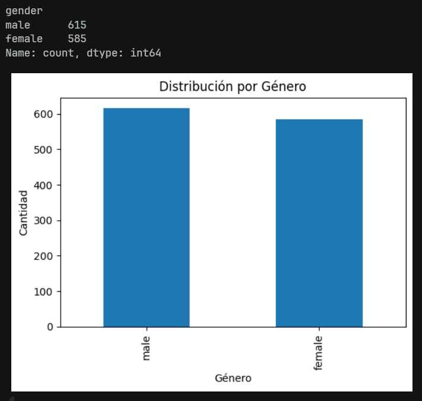

La distribución es relativamente equilibrada, ya que ambos grupos cuentan con una cantidad similar de registros

### Matriz de Correlación

La correlación permite identificar relaciones lineales entre variables y detectar cuáles podrían tener una mayor influencia sobre la variable objetivo.

```python
plt.figure(figsize=(12,8))

sns.heatmap(
    df.corr(numeric_only=True),
    annot=True,
    cmap="coolwarm"
)

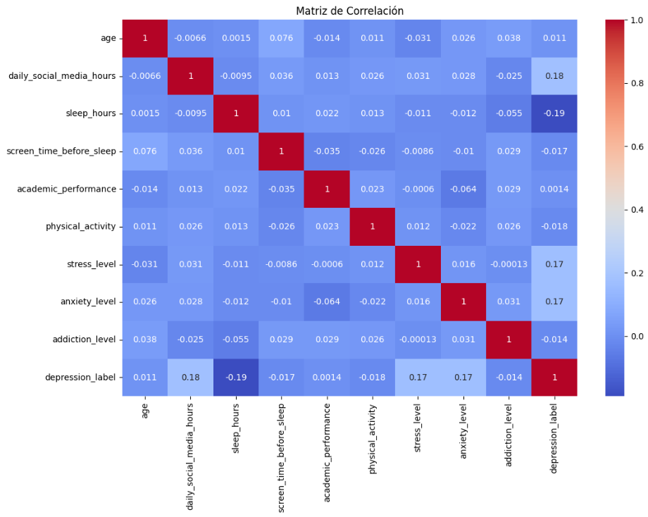

plt.title("Matriz de Correlación")

plt.show()
```

Se observó una correlación positiva entre las horas de uso de redes sociales y depression_label (0.18), sugiriendo que un mayor tiempo de uso podría estar asociado con una mayor presencia de indicadores de depresión.
Las horas de sueño presentaron una correlación negativa con la depresión, indicando que menores periodos de descanso tienden a relacionarse con mayores niveles de afectación emocional.
Las variables stress_level y anxiety_level mostraron correlaciones positivas con depression_label (aproximadamente 0.17).

### Definición de Variables Predictoras y Variable Objetivo

Para definir la información que utilizará el modelo, es necesario separar la variable que se desea predecir de las variables que serán utilizadas como entrada del modelo.

```python
y = df["depression_label"]
x = df.drop("depression_label", axis=1)
```

Para este caso, la variable `depression_label` se define como objetivo y el resto como predictoras.

### Transformación de Variables Categóricas

Los algoritmos de Machine Learning trabajan principalmente con valores numéricos. Por ello, las variables categóricas fueron transformadas mediante One-Hot Encoding.

```python
x = pd.get_dummies(x, drop_first=True)
```
Los algoritmos de Machine Learning, incluyendo algunos modelos, realizan operaciones matemáticas sobre los datos de entrada. Debido a ello, no pueden interpretar directamente valores de texto. Para realizar esta transformación se utilizó la técnica One-Hot Encoding, esta técnica crea una nueva columna para cada categoría posible y asigna valores binarios: (0) la observación pertenece a esa categoría, (1) la observación no pertenece a esa categoría.

Para evitar redundancia en la información y reducir los problemas de multicolinealidad durante el entrenamiento del modelo, se elimina una de las categorías

```python
drop_first=True
```
### División de Datos

Una vez finalizado el preprocesamiento de los datos, el conjunto de información fue dividido en dos subconjuntos: uno destinado al entrenamiento del modelo y otro para evaluar su desempeño, ya que si se entrenara y evaluara con los mismo datos el modelo lanzara resultados aparentemente buenos porque ya ha visto todas las observaciones durante el aprendizaje, sin ambargo esto no garantiza que funcione correctamente con nuevos datos.

Se realizó una separación de:

- 80% para entrenamiento
- 20% para prueba

```python
x_train, x_test, y_train, y_test = train_test_split(
    x,
    y,
    test_size=0.2,
    random_state=42
)
```
Esta proporción es una de las más utilizadas en problemas de clasificación, ya que proporciona suficientes datos para que el modelo aprenda y, al mismo tiempo, reserva una cantidad adecuada de observaciones para evaluar su rendimiento

Después de dividir los datos en conjuntos de entrenamiento y prueba, se realizó un proceso de escalamiento sobre las variables predictoras utilizando la técnica de estandarización, debido a que las variables del dataset no necesariamente se encuentran en la misma escala y cuando existe una diferencia entre escalas, algunas pueden ejercer una influencia mayor durante el entrenamiento.

```python
scaler = StandardScaler()
```
Este procedimiento evita que información del conjunto de prueba influya en el proceso de aprendizaje, lo cual garantiza una evaluación más realista del modelo.

```python
print("\nPrimeras filas escaladas:")
print(x_train_scaled[:5])

print("\nPrimeras etiquetas:")
print(y_train.head())
```
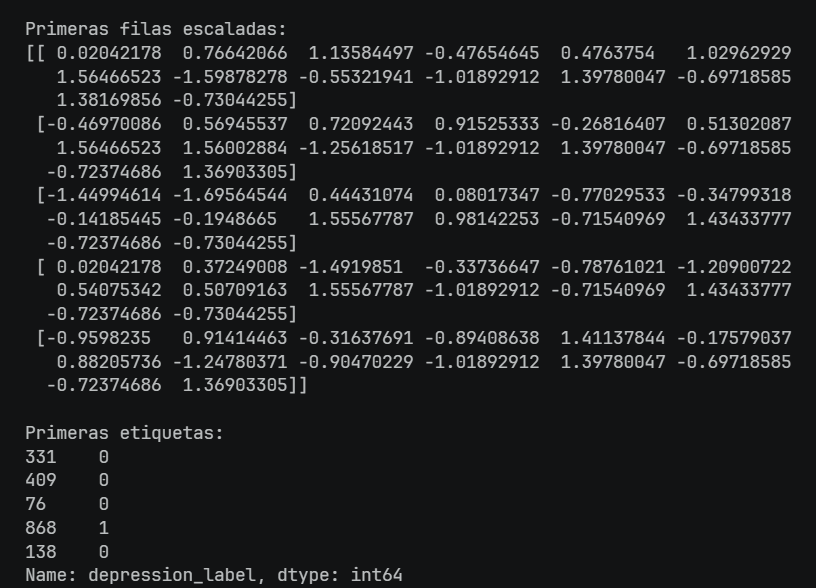

Los valores positivos y negativos del escalamiento, confirma que el proceso de estandarización se realizó correctamente sobre las variables predictoras. Además, se observa que ninguna característica domina por su magnitud numérica, permitiendo que todas contribuyan de manera más equilibrada durante el entrenamiento

---

# Ejecución del Proyecto

## 1. Clonar el repositorio

```bash
git clone https://github.com/YaoCr003/IA.git 
```

## 2. Ejecutar el notebook

Abrir y ejecutar el archivo:

```text
ia.ipynb
```

---

# Estructura del Repositorio

```text
IA/
│
├── data/
│   └── Teen_Mental_Health_Dataset.csv
│
├── notebooks/
│   └── ia.ipynb
│
├── images/
│ 
├── docs/
│
├── models/
│   ├── columns.pkl
│   ├── drepression_model.keras
│   └── scaler.pkl
│
├── app.py
│ 
└── README.md
```


# Fuente del Dataset

Dataset obtenido de Kaggle:

https://www.kaggle.com/datasets/algozee/teenager-menthal-healy

---

# Modificaciones Avance 1

Se implemento mas información dando conceptos e interprentando los resultados
---


# Avance 2: Implementación del Modelo

En esta segunda etapa del proyecto se comenzará a trabajar con la construcción del modelo de Machine Learning. El objetivo principal de esta fase es entrenar el algoritmo capaz de aprender patrones dentro del dataset para posteriormente predecir si un adolescente presenta indicadores de depresión a partir de variables relacionadas con ansiedad, éstres, sueño, desempeño académico y uso de redes sociales.

## Selección del Modelo

El dataset utilizado corresponde a un conjunto de datos tabular relacionado con la salud mental adolescente y uso de redes sociales. La variable `depression_label` representa un problema de clasificación binaria, ya que únicamente puede tomar dos valores (depresion y no depresión).

Debido a estas características, se evaluarón distintos modelos comunmente utilizados en problemas de clasificación supervisada sobre datos tabulares, entre ellos:

### Decision Tree

Este modelo funciona creando reglas de decisión basadas en las variables del dataset. Los árboles de decisión son fáciles de interpretar visualmente, ya que estos modelos están diseñados para procesar colecciones de instancias etiquetadas y transformarlas en reglas lógicas, aunque pueden presentar problemas de sobreajuste cuando el árbol crece demasiado.

### Logistic Regression

Es un modelo estadístico diseñado para analizar la relación entre una variable de respuesta binomial (que solo tiene dos posibles resultados) y una o más variables explicativas. Su procedimiento es similar al de la regresión lineal múltiple, pero se diferencia en que está específicamente estructurado para predecir la probabilidad de que ocurra un evento de interés basándose en características individuales. Este modelo destaca por su versatilidad, ya que puede manejar simultáneamente variables continuas y variables categóricas.


### Modelo a usar

Para este proyecto se seleccionó el modelo de `Logistic Regression` ya que al saber que el dataset utilizado es un conjunto de datos tabular, este modelo se convierte en una muy buena opción ya que este algoritmo es ampliamente utilizado en tareas de clasificación binaria, como lo es en este caso donde la variable objetivo `depression_label` solamente puede tomar dos valores (con depresión o sin depresión). Además resulta un modelo muy apropiado ya que funciona con datasets relativamente pequeños o medianos, como para este proyecto, el cual se esta usando un dataset con aproximadamente 1200 datos.


## Métricas

Para determinar las métricas a usar se realizó una investigación acerca de artículos relacionados con Machine Learning aplicado a la salud mental.

Como lo es el caso del [Articulo 1](Docs/article1.pdf) el cual analiza cómo el aprendizaje automático puede predecir y diagnosticar la depresión utilizando registros médicos electrónicos (EHR). Dentro de los cuales menciona que las métricas usadas son (Accuracy, Precision, Recall y F1-Score)

O el [Articulo 2](Docs/article2.pdf), el cual presenta el desarrollo de un modelo de aprendizaje profundo diseñado para identificar trastornos mentales mediante el análisis de publicaciones en la red social Reddit. Hablando de las métricas, se utilizaron cuatro métricas fundamentales para validar el rendimiento de los modelos de clasificación (XGBoost y CNN), (Accuracy, Precision, Recall y F1-Score).

Analizando ambos artículos sabemos que las métricas más utilizadas para evaluar modelos son `Accuracy, Precision, Recall y F1-Score`. Estas métricas son ampliamente utilizadas dentro del estado del arte debido a que permiten analizar distintos aspectos del desempeño del modelo y proporcionan una evaluación más completa.

- **Accuracy:** Representa la proporción de observaciones correctamente clasificadas respecto al total de observaciones evaluadas. Un valor de accuracy cercano a 1 indica que el modelo realiza una gran cantidad de predicciones correctas.

    - Formula: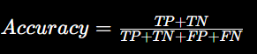

- **Precision:** Mide qué proporción de las observaciones clasificadas como positivas realmente pertenecen a dicha clase. Es especialmente importante cuando los falsos positivos representan un problema relevante

    - Formula: 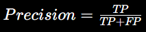

- **Recall:** Mide la capacidad del modelo para identificar correctamente todos los casos positivos existentes en el conjunto de datos. Un valor elevado de recall indica que el modelo detecta la mayoría de los casos positivos reales.

    - Formula: 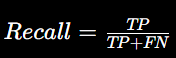 

- **F1-Score:** Combina la precisión y el recall en una única métrica, resulta particularmente útil cuando existe un desbalance entre clases, ya que considera simultáneamente la capacidad del modelo para identificar correctamente los casos positivos

    - Formula: 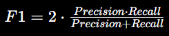


## Implementación

Tanto el modelo como las métricas seleccionadas fueron implementadas utilizando la libreria `Scikit-learn`.

```python
from sklearn.linear_model import LogisticRegression
```
Aquí se importa el algoritmo `Logistic Regression`. Este framework proporciona implementaciones ya optimizadas de distintos modelos de Machine Learning, permitiendo entrenar modelos sin necesidad de programar manualmente todas las operaciones matemáticas.

```python
from sklearn.metrics import (
    accuracy_score,
    precision_score,
    recall_score,
    f1_score,
    confusion_matrix,
    classification_report
)
```
Posteriormente importamos las métricas de evaluación que se utilizarán para analizar el desempeño del modelo una vez finalizado el entrenamiento. Además de las métricas númericas, tambien se importó `confusion_matrix`, la cual es una herramienta que permite vizualizar gráficamente los aciertos y errores cometidos (TP, TN, FP, FN) por el modelo durante la clasificación.

De igual forma se importo `classification_report` que genera un resumen completo con todas las métricas principales obtenidas durante la evaluación.

Apesar que el proyecto ya cuenta con datos organizados y preprocesados, todavia no existe ningún sistema capaz de aprender patrones o realizar clasificaciones automáticamente, Por ello crearemos primero el modelo:

```python
model = LogisticRegression()
```
Se crea una instancia del algoritmo Logistic Regression con sus parametros iniciales por defecto. Lo cual el framework prepara toda la lógica matemática necesaria para trabajar con problemas de clasificación binaria.

Después de crear el modelo empezamos el entrenamiento, el algoritmo intenta encontrar la mejor combinación de pesos matemáticos para cada variable predictora con el objetivo de clasificar correctamente los registros entre las clases 0 y 1.
Logistic Regression analiza cada registro del conjunto de entrenamiento y busca identificar relaciones entre las variables de entrada y la variable objetivo

```python
model.fit(x_train_scaled, y_train)
```
El entrenamiento se implementa usando la función `fit()` donde `x_train_scaled` contiene las variables predictoras ya escaladas (calculadas en el preprocesamiento) porque Logistic Regression presenta un mejor desempeño cuando todas las variables poseen magnitudes similares, mientras que `y_train` contiene las etiquetas reales asociadas a cada registro,con el objetivo de aprender patrones que permitan clasificar correctamente nuevos registros.

El modelo ya aprendió patrones matemáticos relacionados con las variables del proyecto, sin embargo, unicamente ha trabajado con los datos de entrenamiento. Por ello es necesario evaluar si el modelo realmente aprendió patrones útiles, para comprobar esto se utilizan los datos de prueba (`x_train_scaled`). Por ello generaremos predicciones.

```python
y_pred = model.predict(x_test_scaled)
```
Logistic Regression toma cada registro de `x_test_scaled` y aplica la ecuación matemática aprendida durante el entrenamiento. Para cada adolescente del dataset, el modelo calcula una probabilidad de pertenecer a la clase positiva.

Internamente ocurre esto:

1. El modelo recibe las variables predictoras del adolescente.
2. Utiliza los pesos aprendidos durante el entrenamiento.
3. Calcula un valor numérico utilizando la ecuación de regresión logística. 

    - 

4. Aplica la función sigmoide para transformar el resultado en una probabilidad entre 0 y 1.

    - 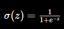

5. Finalmente, clasifica el registro como:
    - 0 -> Sin depresión.
    - 1 -> Con depresión.

En este punto se ya generó una clasificación para cada registro, sin embargo, aún no sabemos si esas predicciones son correctas o incorrectas. Las metricas funcionan comparando los valores reales(`y_test`) contra las predicciones del modelo (`y_pred`).

**Accuracy**

```python
accuracy = accuracy_score(y_test, y_pred)
```
Esto permite medir qué tan frecuentemente el modelo acierta.

**Precision**

```python
precision = precision_score(y_test, y_pred)
```
Mide la confiabilidad del modelo cuando detecta casos positivos, es decir, analiza cuántas veces el modelo dijo “sí hay depresión” y cuántas de esas veces realmente era cierto.

**Recall**

```python
recall = recall_score(y_test, y_pred)
```
Recall compara todos los casos reales positivos, contra los que el modelo logró detectar correctamente, esta metrica es importante porque puede indicar que cuando señala un falso negativo significa que existe un adolescente con depresión que el modelo NO detectó.

**F1-Score**

```python
f1 = f1_score(y_test, y_pred)
```
Esta métrica combina precision y recall en una sola medida balanceada, el punto de esta métrica es, entre detectar casos positivos

Despues de verificar el comportamiento del modelo mediante las métricas, realizamos _Matriz de confusión_, la cual permite visualizar de manera detallada qué tipos de aciertos y errores está cometiendo el modelo graficamente, permite observar exactamente cuántos registros fueron clasificados correctamente y cuántos fueron clasificados incorrectamente.

```python
cm = confusion_matrix(y_test, y_pred)
plt.figure(figsize=(6,4))

sns.heatmap(cm, annot=True, fmt="d", cmap="Blues")

plt.title("Matriz de Confusión")
plt.xlabel("Predicción")
plt.ylabel("Valor Real")

plt.show()
```

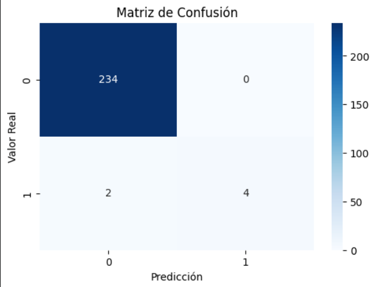

Dentro de los resultados obtenidos se puede decir lo siguiente:

- El modelo clasifico correctamente 234 adolescentes que NO presentaban depresión. (TN)
- El modelo nunca clasificó incorrectamente a un adolescente sano como si tuviera depresión. (FP)
- El sistema no detectó correctamente un posible caso real de depresión, existían 2 adolescentes con depresión real pero el modelo los clasificó como si NO tuvieran depresión. (FN)
- El modelo señalo que existían 4 adolescentes con depresión, y el modelo logró detectarlos correctamente. (TP)

Finalmente imprimimos los resultados obtenidos:

```python
print(classification_report(y_test, y_pred))
```
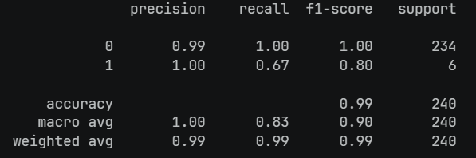

Los resultados obtenidos muestran que el modelo Logistic Regression alcanzó una accuracy de 99%,que indica el modelo acertó aproximadamente el 99% de las predicciones totales. Sin embargo, debido al desbalance presente en el dataset, fue necesario analizar métricas adicionales como Precision, Recall y F1-Score.

El modelo presentó un desempeño casi perfecto para la clase negativa (0), identificando correctamente la mayoría de los adolescentes sin indicadores de depresión. Para la clase positiva (1), el modelo obtuvo una precisión de 1.00, lo que indica que todas las predicciones positivas realizadas fueron correctas.

El recall obtenido para la clase positiva fue de 0.67, lo que significa que algunos casos reales de depresión no fueron detectados por el modelo

El F1-Score de 0.80 refleja un equilibrio adecuado entre precisión y capacidad de detección, aunque todavía existe margen de mejora en la identificación de adolescentes con posibles indicadores de depresión.

# Modificaciones de avance 2

Se implemento la red neuronal para poder hacer el despliegue de una aplicación que al introducir datos genere la predicción, de igual forma observar los resultados del modelo con la red neuronal. Se ajusto la arquitectura del proyecto

# Avance 3

## Implementación de la Red Neuronal

### Arquitectura MLP

```python
nn_model = Sequential([

    Dense(
        64,
        activation="relu",
        input_shape=(x_train_scaled.shape[1],)
    ),

    Dense(
        32,
        activation="relu"
    ),

    Dense(
        1,
        activation="sigmoid"
    )

])
```

Usamos dos capas ocultas de 64 y 32 neuronas, permitiendo que el modelo aprenda las relaciones complejas entre las variables de entrada. A diferencia de modelos lineales como la regresión logística, una red neuronal puede detectar patrones no lineales.

### Compilación 

```python

nn_model.compile(
    optimizer="adam",
    loss="binary_crossentropy",
    metrics=["accuracy"]
) 

```

Una vez establecido la arquitectura, procederemos ahora a explicarle indicar como es que la red neuronal aprendera, como es que actualizara los pesos, en este caso "adam" el cual es un optimizardo encargado de ajustar los pesos de la red, es decir que cada vez que se equivoca, Adam decide cuánto deben cambiar los pesos para mejorar la siguiente predicción, que tan equivocada esta la red `loss` y las métrica deseas observar mientras la red entrena `metrics`

### Checkpoint

```python

checkpoint = ModelCheckpoint(
    "best_depression_model.keras",
    monitor="val_accuracy",
    save_best_only=True,
    verbose=1
) 
```

Ahora no solo necesitamos el decirle a la red como es que aprenderá, si no tambien se requiere guardar el mejor modelo obtenido durante las épocas de entrenamiento, sin esto guardara el desempeño de la ultima época y en ocaciones no es el mejor.


### Entrenamiento

``` python

history = nn_model.fit(
    x_train_scaled,
    y_train,
    epochs=100,
    batch_size=16,
    validation_split=0.2,
    callbacks=[checkpoint],
    verbose=1
)

```

Ya tenemos la arquitectura, despues se le dijo a led como aprender, guardar el mejor modelo y función de perdida y pesos de la clase, todo eso se pone en practica durante el entrenamiento. El recorrido de todos los datos lo hara en 100 epocas es decir 100 veces, en registros de 16, despues se manda a llamar al checkpoint para que guarde la mejor versión del modelo.

### Vizualizacion del entrenamiento

#### Accuracy

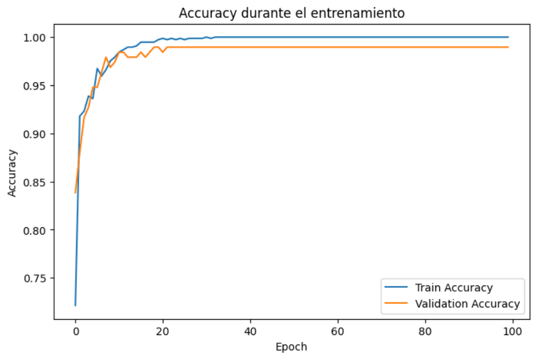

La gráfica muestra la evolución de la precisión del modelo a medida que avanzan las épocas. Comparando la precisión obtenida sobre los datos que la red está utilizando para aprender con la precisión obtenida sobre el 20% de datos reservado

#### Loss

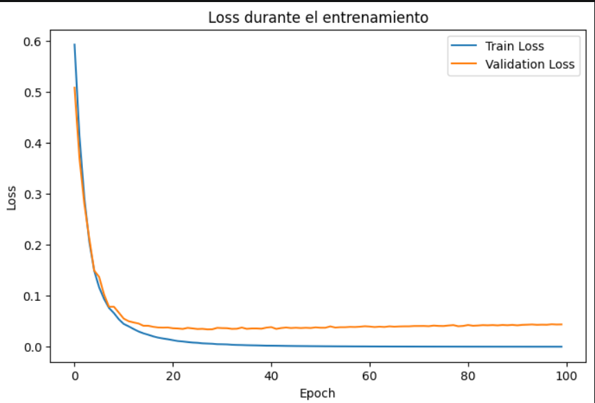

Esta grafica muestra el error que comente la red neuronal sobre los datos de entrenamiento y los datos que la red no utilizó para ajustar sus pesos

### Predicción

``` python
y_pred_prob = nn_model.predict( x_test_scaled )
```

Aquí la red recibe los datos de prueba escalados, y genera una probabilidad por cada registro, sin embargo para trabajar calacular las metricas se necesitan converitir las probabilidades a clases:

``` python
y_pred_nn = (y_pred_prob > 0.3).astype(int)
```

Se compara cada probabilidad con un umbral en este caso _0.3_ para clasificar cada probabilidad si la probabilidad es mayor a 0.3 pasa a la clase (1) si no a la clase (0)

### Métricas

``` python
accuracy_nn = accuracy_score(y_test, y_pred_nn)
precision_nn = precision_score(y_test, y_pred_nn)
recall_nn = recall_score(y_test, y_pred_nn)
f1_nn = f1_score(y_test,y_pred_nn)
```

Todas las metricas se calculan comparando los resultados reales `y_test` contra las predicciones de la red `y_pred_nn`.

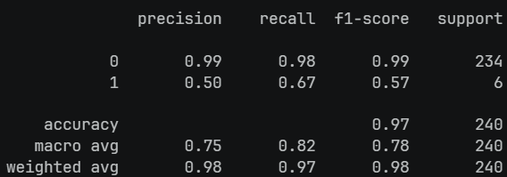

Como resultado la red neuronal identifica muy bien a los adolescentes que no presentan depresión. Sin embargo para identificar a los adolescentes con depresión, el recall 66% la red detecto 4 de los 6 casos reales de depresión, precisión del 50%, predijo que la mitad de los casos donde hay depresión solo la mitad fueron casos reales.

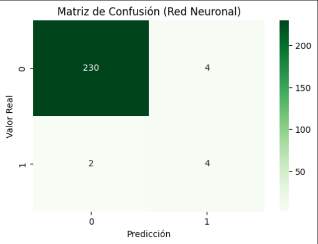

En la matriz podermos ver lo siguiente:
- 4 adolescentes los marco que si tenian depresion y el modelo predijo que si. (TP)
- 234 adolescentes no tenían depresión y fueron clasificados correctamente. (TN)
- 4 Adolescentes no tenían depresión pero el modelo dijo que sí. (FP)
- 2 adolescentes tenían depresión pero el modelo no los detectó. (FN)

### Guardar modelo

``` python
best_model = load_model("./best_depression_model.keras")
best_model.save("../models/depression_model.keras")
```

Se carga el mejor modelo que se detecto durante el entrenamiento, es decir, recupera la arquitectura, los pesos y la configuración aprendida por la red.
Para después guardar una copia de ese modelo en la carpeta `models`, que sera utilizada posteriormente para realizar las predicciones sin necesidad de volver a entrenar.

``` python
joblib.dump(scaler, "../models/scaler.pkl")
```
De igual forma se guarda el objeto `StandardScaler` entrenado para poder aplicarlo a nuevos datos sin tener que volver a entrenar el modelo, ni recalcular el escalamiento.

``` python
joblib.dump(x.columns.tolist(), "../models/columns.pkl")
```
Por último almacenamos la estructura final de las variables utilizadas durante el entrenamiento, esto permite que, durante el despliegue del modelo, los nuevos datos que sean ingresados por el usuario sean transformados exactamente con las mismas columnas que fueron utilizadas para entrenar la red.

## Aplicación y despligue

Finalmente, se desarrollo una aplicación interactiva utilizando `Streamlit`, permitiendo que un usuario introduzca nuevos datos y obtenga una estimación de la probabilidad de depresión de manera automática. 

### Carga de los artefactos entrenados

``` python
model = load_model("./models/depression_model.keras")
scaler = joblib.load("./models/scaler.pkl")
columns = joblib.load("./models/columns.pkl")
```
La idea es reutilizar lo apendido durante el entrenamiento, cargando la red neuronal entrenada, el `StandardScaler` entrando y las columnas generadas después del **One Hot Encoding**.

### Creación de la interfaz

```python
st.title("Predicción de Depresión en Adolescentes")

st.write(
    "Ingrese los datos para estimar la probabilidad de depresión."
)

age = st.number_input(
    "Edad",
    min_value=13,
    max_value=19,
    value=16
)

gender = st.selectbox(
    "Género",
    ["female", "male"]
)

daily_social_media_hours = st.number_input(
    "Horas diarias en redes sociales",
    min_value=0.0,
    max_value=24.0,
    value=4.0
)

sleep_hours = st.number_input(
    "Horas de sueño",
    min_value=0.0,
    max_value=12.0,
    value=8.0
)

screen_time_before_sleep = st.number_input(
    "Tiempo de pantalla antes de dormir (horas)",
    min_value=0.0,
    max_value=5.0,
    value=1.0
)

academic_performance = st.slider(
    "Rendimiento académico",
    1,
    10,
    5
)

physical_activity = st.slider(
    "Actividad física",
    1,
    10,
    5
)

stress_level = st.slider(
    "Nivel de estrés",
    1,
    10,
    5
)

anxiety_level = st.slider(
    "Nivel de ansiedad",
    1,
    10,
    5
)

addiction_level = st.slider(
    "Nivel de adicción",
    1,
    10,
    5
)

platform_usage = st.selectbox(
    "Plataforma más utilizada",
    [
        "Instagram",
        "TikTok",
        "Other"
    ]
)

social_interaction_level = st.selectbox(
    "Nivel de interacción social",
    [
        "low",
        "medium",
        "high"
    ]
)
```
Se construye la interfaz visual del usuario para que pueda ingresar nuevos datos y el modelo pueda generar una predicción de la variable objetivo, es decir, que pueda darle un resultado sobre la probabilidad que pueda tener ansiedad.

### DataFrame

```python
data = pd.DataFrame([{

    "age": age,
    "gender": gender,
    "daily_social_media_hours":
        daily_social_media_hours,

    "sleep_hours":
        sleep_hours,

    "screen_time_before_sleep":
        screen_time_before_sleep,

    "academic_performance":
        academic_performance,

    "physical_activity":
        physical_activity,

    "stress_level":
        stress_level,

    "anxiety_level":
        anxiety_level,

    "addiction_level":
        addiction_level,

    "platform_usage":
        platform_usage,

    "social_interaction_level":
        social_interaction_level
}])
```
Este DataFrame se creo para que la información tenga exactamente el mismo formato que el dataset utilizado durante el entrenamiento.

### Tranformación de variables categóricas

```python
data = pd.get_dummies(
    data,
    drop_first=True
)
```
Como se hizo durante el preprocesamiento del modelo, al saber que las redes neuronales trabajan con valores númericos, las varaibles categoricas deben transformarse mediante One Hot Encoding.

### Restauración de columnas originales

```python
data = data.reindex(
    columns=columns,
    fill_value=0
)
```
La restauración de columnas se realiza para garantizar que los nuevos datos tengan la misma estructura que los datos utilizados durante el entrenamiento.

### Escalamiento de los datos

```python
data_scaled = scaler.transform(data)
```

Los datos son normalizados utilizando el mismo StandardScaler que fue entrenado previamente y con esto garantizamos que la red neuronal reciba los datos en la misma escala que utilizó durante el aprendizaje.

### Predicción con la red neuronal

```python
probability = model.predict(
    data_scaled
)[0][0]
```
La red neuronal procesa los datos y genera una probabilidad.

### Probabilidad

```python
prediction = int(
    probability > 0.3
)
```
La probabilidad se convierte en una descisión binaria, es decir, que si la probabilidad supera el umbral establecido `1 = Posible depresión` si no lo supera `0 = No depresión`

### Resultados

```python
st.subheader("Resultado")

    st.write(
        f"Probabilidad de depresión: {probability:.2%}"
    )

    st.write(
        f"Probabilidad de no depresión: {(1-probability):.2%}"
    )

    if prediction == 1:

        st.error(
            "Posible presencia de depresión"
        )

    else:

        st.success(
            "No se detectan indicadores de depresión"
        )
```

Finalmente se muestran los resultados, lo que son el porcentaje estimado de depresión y la probabilidad de no depresión, así mismo se reflejara un mensaje interpretativo, si existe o no indicadores de depresión.


## Visualización del dashboard

### Indicadores de depresión:

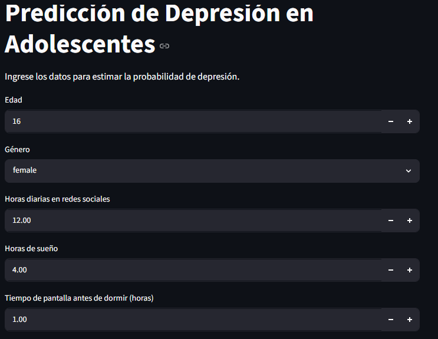
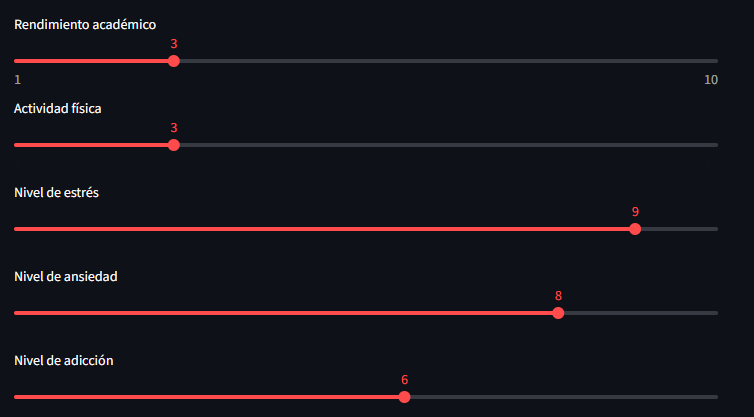
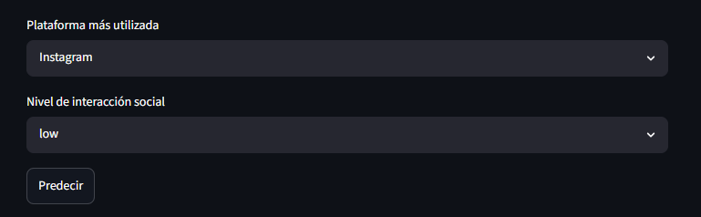

### Resultados

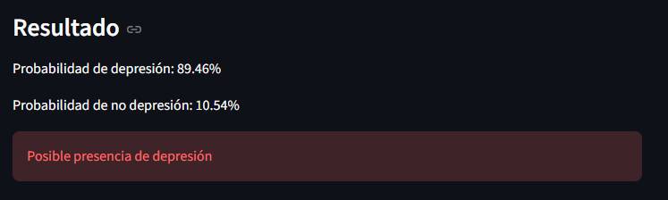

### Indicadores de no depresión:

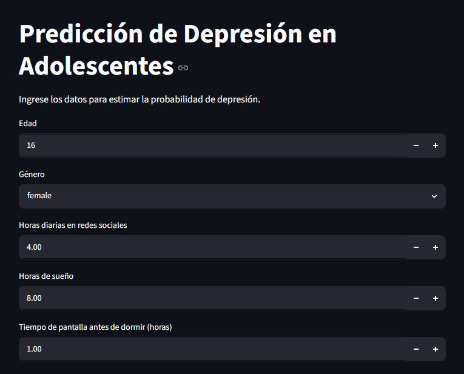
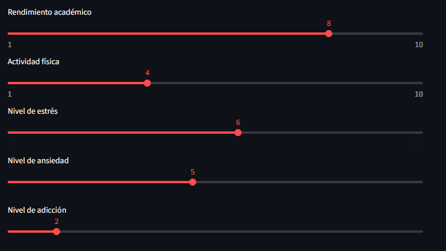
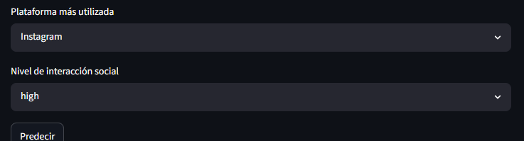

### Resultados

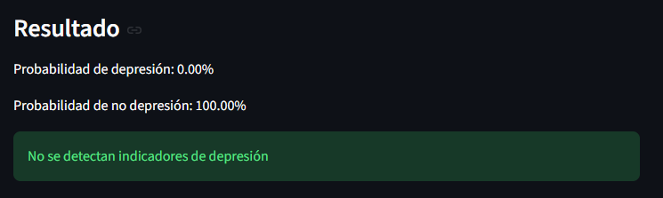

# Refinamiento

El conjunto de datos utilizado presentó un marcado desbalance entre las clases, ya que los registros correspondientes a depresión representaban una pequeña proporción del total. De acuerdo con He y García (2009) señalados en su artículo `Learning from Imbalanced Data` [Articulo 3](./docs/Learning_from_imbalanced_data.pdf), esta situación puede inducir sesgos hacia la clase mayoritaria y afectar negativamente la detección de eventos poco frecuentes. 

Para mitigar este problema, se utilizarón pesos de clase, ya que esto permite asignar una _"penalización"_ mayor a los errores cometidos por la clase minoritaria, con el fin de obligar a la red neuronal a prestar más atención a los casos de depresión durante el entrenamiento y mejorando su capacidad de detección. 

``` python

class_weights = compute_class_weight(
    class_weight="balanced",
    classes=np.unique(y_train),
    y=y_train
)

class_weights = dict(
    enumerate(class_weights)
)
```

Ya que la variable ojetivo `drepression_label` tiene 1169 registros de "No depresion" y 31 de "Depresión", si esto lo entrenamos sin hacer el reajuste de pesos, el modelo siempre predecira "No depresión" y esto generara problemas con las metricas Precision, Recall y F1-Score, ya que incluso pueda dar como resultado 0 porque nunca detecta casos reales de depresión.

``` python

history = nn_model.fit(
    x_train_scaled,
    y_train,
    epochs=100,
    batch_size=16,
    validation_split=0.2,
    callbacks=[checkpoint],
    class_weight=class_weights,
    verbose=1
)

```
En la parte del entrenamiento llamamos a la clase de los pesos, dandole a entender a la red que fallar en detectar "Depresión" es mas grave. Sin esto, la red neuronal tendería a favorecer la clase mayoritaria, obteniendo una alta exactitud pero una baja capacidad para detectar casos reales de depresión. Con los pesos, se obliga al modelo a prestar mayor atención a los casos positivos y mejorando métricas relevantes como Recall y F1-Score

## Sin pesos
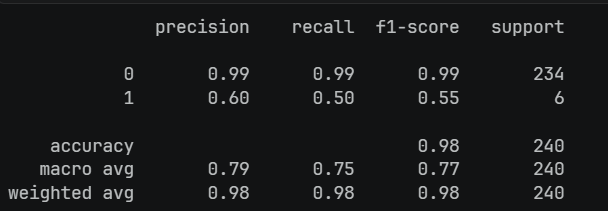

## Con pesos
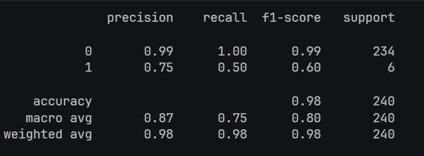

Al comparar los resultados, se observa que la Accuracy general se mantiene prácticamente igual, sin embargo, las métricas asociadas a la clase de depresión muestran una mejora. La Precision aumentó de 0.60 a 0.75, lo que indica que las predicciones positivas realizadas por la red son más confiables y presentan menos falsos positivos. Asimismo, el F1-Score aumentó de 0.55 a 0.60, reflejando un mejor equilibrio entre precisión y sensibilidad. Esto demuestra que el uso de pesos permitió que el modelo prestara mayor atención a la clase minoritaria.

